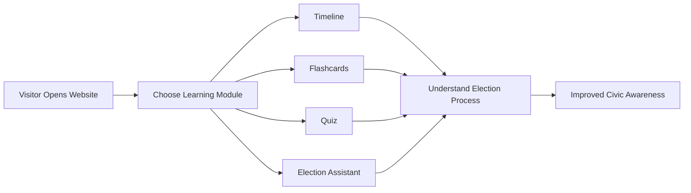

# 🗳️ Election Guide
### *Making Indian Elections Easy to Understand*

<p align="center">


</p>

<p align="center">
An interactive educational platform that transforms the complex Indian election process into an engaging visual learning experience through timelines, quizzes, flashcards, and guided conversations.
</p>

---

# 🌐 Live Demo

### 🚀 **Try the Application**

**https://election-guide-olive.vercel.app/**

---

# 📖 Why Election Guide?

Understanding elections shouldn't require reading hundreds of pages of documentation.

Election Guide provides a modern, interactive learning experience that explains how Indian elections work using visual storytelling, concise explanations, quizzes, and conversational guidance. Whether you're a first-time voter, student, or simply curious about the electoral process, the application makes learning approachable and engaging.

---

# ✨ Core Learning Modules

| Module | Description |
|---------|-------------|
| 🗓 Interactive Timeline | Explore every major stage of an Indian General Election through an intuitive timeline. |
| 🧠 Flashcards | Learn important election terminology with animated flip cards. |
| 🧪 Quiz Arena | Test your knowledge using multiple-choice questions. |
| 🤖 Election Assistant | Ask questions and receive guided educational responses. |
| 🎨 Modern Interface | Glassmorphism UI with smooth transitions and responsive layouts. |

---

# 🏗 Learning Journey

```mermaid
journey
title User Learning Journey

section Discover
Visit Website
Browse Modules

section Learn
Explore Timeline
Read Flashcards
Understand Concepts

section Practice
Attempt Quiz
Review Answers

section Explore
Ask Election Assistant
Gain More Knowledge

section Complete
Become Election Aware
```

---

# 🧩 Application Structure

```mermaid
mindmap
root((Election Guide))

Timeline

Election Stages

Government Formation

Flashcards

EVM

VVPAT

Lok Sabha

MCC

Quiz

Questions

Score

Assistant

Educational Guidance

Voting Information

Responsive UI

Animations

Glassmorphism
```

---

# ⚙ How Everything Works



---

# 📂 Project Structure

```text
Election-Guide/

├── index.html
├── styles.css
├── app.js
├── data.js
├── assets/
│   ├── images/
│   └── icons/
├── README.md
└── LICENSE
```

---

# 🎯 Design Philosophy

The interface is designed around three principles:

- 📚 Learn visually rather than reading lengthy articles
- ⚡ Keep interactions lightweight and fast
- 🎨 Make educational content engaging through modern UI

---

# 🚀 Getting Started

## Clone the Repository

```bash
git clone https://github.com/tanush326k/Election-Guide.git
```

## Navigate into the Project

```bash
cd Election-Guide
```

## Run Locally

Simply open **index.html** in your browser.

No installation or dependencies are required.

---

# 💻 Technology Stack

| Technology | Purpose |
|------------|---------|
| HTML5 | Application Structure |
| CSS3 | Styling & Glassmorphism UI |
| JavaScript (ES6+) | Interactive Functionality |
| Vercel | Hosting & Deployment |

---

# 🌟 Highlights

✅ Fully Responsive

✅ Interactive Learning Experience

✅ Modern Glassmorphism Design

✅ Lightweight & Fast

✅ Browser-Based

✅ Beginner Friendly

✅ Educational Focus

---

# 🔮 Future Roadmap

- 🌍 Multi-language support
- 🎙 Voice-assisted learning
- 📈 Progress tracking
- 📱 PWA support
- 🏆 Achievement badges
- 📚 Additional election resources
- 🎥 Interactive explainers

---

# 📜 License

This project is licensed under the **MIT License**.

See the **LICENSE** file for more information.

---

# 🙌 Acknowledgements

Special thanks to publicly available educational resources on Indian elections and civic awareness that inspired this interactive learning experience.

---

<p align="center">

### ⭐ If you found this project useful, consider giving it a star!

Made with ❤️ to promote civic awareness through technology.

</p>
