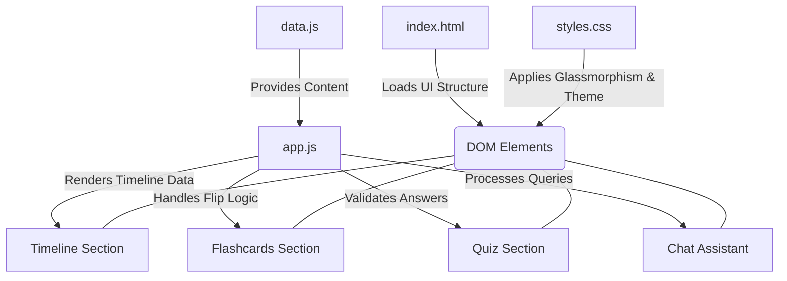

# Indian Election Assistant

The **Indian Election Assistant** is an interactive, educational web application designed to help users understand the Indian election process, timelines, and key steps in an engaging and easy-to-follow way.

## Features

- **Interactive Timeline**: A visual, step-by-step guide outlining the 2024 Indian General Election schedule, from the initial announcement to government formation.
- **Flashcards**: Flippable learning cards to help users memorize critical election terminology such as EVM, VVPAT, Lok Sabha, and the Model Code of Conduct.
- **Knowledge Quizzes**: An integrated multiple-choice quiz system that allows users to test their understanding of the election process.
- **Chat Assistant**: A simulated conversational bot that can guide the user through the steps of voting and answer basic questions regarding the election.

## Technology Stack

The application is built to be lightweight, performant, and visually stunning.
- **Frontend**: Vanilla HTML5, CSS3 (Custom Variables, Glassmorphism, Animations), and JavaScript (ES6+).
- **Deployment**: Packaged using a `Dockerfile` and Nginx, deployed seamlessly to Google Cloud Run.

## Architecture & Data Flow

Below is a diagram illustrating the component architecture and how data flows within the application.



## How to Run Locally

1. Clone the repository.
2. Open `index.html` in any modern web browser.
3. No build tools or package managers are required to run the local development version.

## Deployment to Google Cloud Run

To deploy this application to Google Cloud Run:

1. Ensure the Google Cloud SDK is installed and authenticated.
2. Run the deployment command:
   ```bash
   gcloud run deploy election-assistant --source . --region us-central1 --allow-unauthenticated --port 80
   ```
