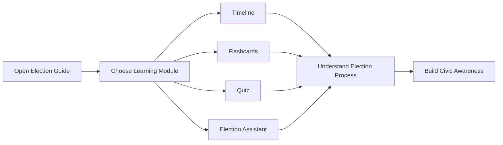
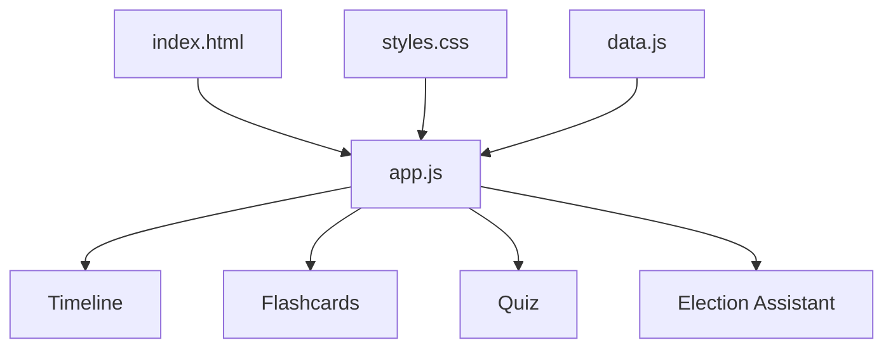
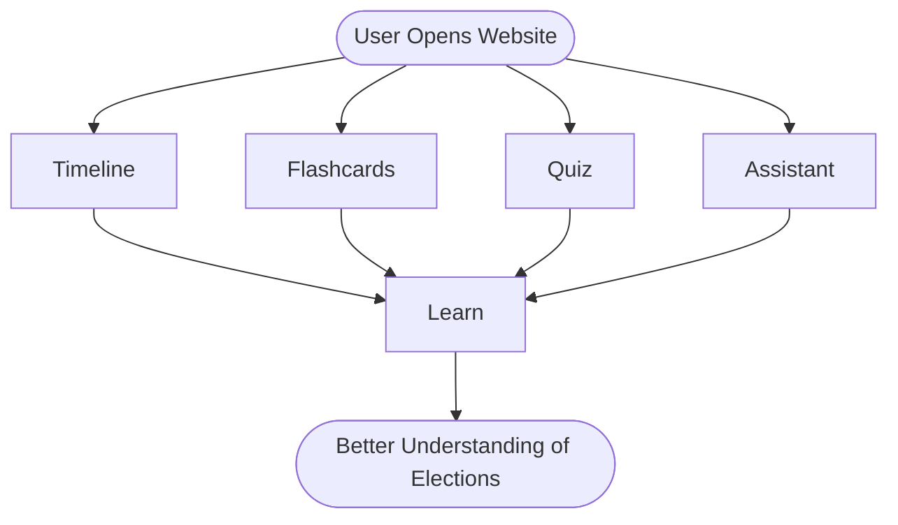

<div align="center">

# 🗳️ Election Guide

### *An Interactive Platform for Understanding the Indian Election Process*

<p>
An educational web application that simplifies the Indian election process through interactive learning modules, visual storytelling, quizzes, and guided assistance.
</p>

<p>


</p>

### 🌐 Live Application

### **https://election-guide-olive.vercel.app/**

</div>

---

# 📚 Overview

Election Guide is an interactive educational platform built to make learning about the Indian electoral process engaging and accessible.

Instead of reading lengthy articles, users can explore election concepts through visual timelines, flashcards, quizzes, and an interactive assistant—all within a fast, browser-based experience.

Whether you're a first-time voter, student, or simply interested in understanding how elections work, Election Guide provides an intuitive learning journey.

---

# ✨ Features

| Feature | Description |
|----------|-------------|
| 🗓 Interactive Timeline | Explore each stage of the Indian General Election from announcement to government formation. |
| 🧠 Flashcards | Learn important election terms through interactive flip cards. |
| 🧪 Quiz Module | Test your understanding with multiple-choice questions. |
| 🤖 Election Assistant | Receive guided explanations for common election-related topics. |
| 🎨 Modern UI | Clean glassmorphism interface with smooth animations. |
| 📱 Responsive Design | Optimized for desktops, tablets, and mobile devices. |

---

# 🚀 User Experience



---

# 🏗 Application Architecture



---

# 🔄 Application Workflow



---

# 📂 Project Structure

```text
Election-Guide/

├── index.html
├── styles.css
├── app.js
├── data.js
├── assets/
│   ├── icons/
│   ├── images/
│   └── illustrations/
├── README.md
└── LICENSE
```

---

# 🛠 Technology Stack

| Technology | Purpose |
|------------|---------|
| HTML5 | Application Structure |
| CSS3 | Styling & Glassmorphism |
| JavaScript (ES6+) | Interactive Features |
| Vercel | Deployment & Hosting |

---

# 🌟 Highlights

- Interactive learning experience
- Visual representation of election stages
- Lightweight architecture
- Modern responsive interface
- Browser-based (no installation required)
- Educational and beginner-friendly
- Fast loading experience

---

# 🚀 Getting Started

## Clone the Repository

```bash
git clone https://github.com/tanush326k/Election-Guide.git
```

## Navigate to the Project

```bash
cd Election-Guide
```

## Launch

Simply open **index.html** in your preferred browser.

No package installation or build process is required.

---

# 📸 Screenshots

You can add screenshots here later.

```text
docs/

├── home.png
├── timeline.png
├── flashcards.png
├── quiz.png
└── assistant.png
```

---

# 🎯 Project Goals

The primary objective of Election Guide is to:

- Encourage civic awareness
- Simplify election education
- Present information visually
- Promote interactive learning
- Help first-time voters understand the electoral process

---

# 🔮 Future Enhancements

- 🌍 Multi-language support
- 🎙 Voice-enabled assistant
- 📈 Learning progress tracker
- 🏆 Achievement badges
- 📄 Printable election guides
- 🌐 Accessibility improvements
- 📱 Progressive Web App (PWA)

---

# 🤝 Contributing

Contributions are always welcome.

If you'd like to improve the project:

1. Fork the repository
2. Create a feature branch
3. Commit your changes
4. Open a Pull Request

---

# 📄 License

This project is licensed under the **MIT License**.

See the **LICENSE** file for additional information.

---

# 💙 Acknowledgements

This project was created to encourage civic awareness through interactive technology and modern web development.

---

<div align="center">

### ⭐ If you enjoyed this project, consider giving it a star!

Made with ❤️ for learning, technology, and civic awareness.

</div>
````
